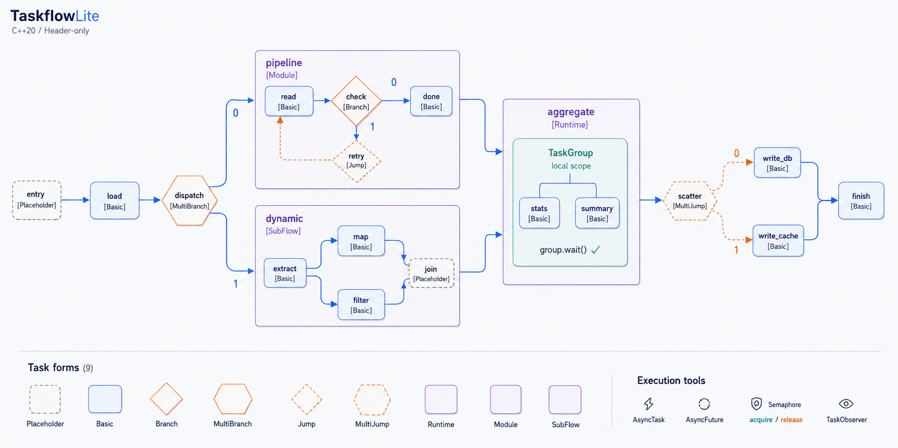

# TaskflowLite

[](https://github.com/wicyn/taskflowlite/actions/workflows/ubuntu.yml)
[](https://github.com/wicyn/taskflowlite/actions/workflows/windows.yml)
[](https://github.com/wicyn/taskflowlite/actions/workflows/macos.yml)
[](https://github.com/wicyn/taskflowlite/actions/workflows/codeql-analysis.yml)
[](https://github.com/wicyn/taskflowlite/actions/workflows/ci.yml)
[](#环境要求)
[](LICENSE)
[](#安装与集成)

**简体中文** · [English](README.en.md)

[](documentation/img/taskflowlite-overview.png)

TaskflowLite（简称 tfl）是一个轻量级、仅头文件的 C++20 任务并行库，受 [Taskflow](https://github.com/taskflow/taskflow) 启发，提供任务依赖图、异步调度和运行时控制流。

## 特性

- **任务图**：构建 DAG，管理任务依赖，支持占位节点和任务重绑定。
- **异步任务**：即时提交、延迟启动、依赖编排与共享结果。
- **动态调度**：Runtime、动态 SubFlow 和作用域 TaskGroup。
- **控制流**：条件分支、多分支、跳转、重复执行和模块嵌套。
- **执行控制**：协作等待、异常传播、协作取消和信号量限流。
- **可观测性**：任务观察者、Worker 生命周期回调和 D2 图导出。
- **集成方式**：仅头文件，提供 CMake 导出目标。

## 环境要求

- C++20 编译器与标准库，支持 `std::format`、原子等待等 C++20 功能。
- 使用 GCC 时需要 GCC 13 及以上版本的配套 libstdc++；Clang / MSVC 需要具备相应功能的标准库。
- CMake 3.21 或更高版本（使用 CMake 时）。

---

## 快速开始

```cpp
#include <cstring>
#include <iostream>
#include <taskflowlite/taskflowlite.hpp>

int main() {
    tfl::Executor executor(4);
    tfl::Flow flow;

    const int input = 10;
    int left = 0;
    int right = 0;
    int result = 0;

    auto [A, B, C] = flow.emplace(
        [input, &left] { left = input * 2; },
        [input, &right] { right = input + 12; },
        [&left, &right, &result] { result = left + right; }
    );

    C.succeed(A, B);
    executor.async(flow).get();

    std::cout << result << '\n';  // 42
}
```

A、B 可以并行执行，C 在两者完成后执行。任务参数通过 lambda 捕获传入；`get()` 等待完成并传播异常。

---

## 安装与集成

### 作为 CMake 子项目

将仓库放入项目的 `external/taskflowlite` 目录，保存上面的代码为 `main.cpp`：

```cmake
cmake_minimum_required(VERSION 3.21)
project(my_app LANGUAGES CXX)

add_subdirectory(external/taskflowlite)

add_executable(my_app main.cpp)
target_link_libraries(my_app PRIVATE TaskflowLite::taskflowlite)
```

`TaskflowLite::taskflowlite` 提供头文件路径、C++20 要求和平台链接依赖。

### 安装后使用

在 TaskflowLite 仓库根目录执行：

```bash
cmake -S . -B build/install -DTFL_BUILD_EXAMPLES=OFF -DTFL_BUILD_TESTS=OFF -DTFL_BUILD_BENCHMARKS=OFF
cmake --install build/install --prefix /path/to/taskflowlite-install
```

消费项目的 `CMakeLists.txt`：

```cmake
cmake_minimum_required(VERSION 3.21)
project(my_app LANGUAGES CXX)

find_package(TaskflowLite CONFIG REQUIRED)

add_executable(my_app main.cpp)
target_link_libraries(my_app PRIVATE TaskflowLite::taskflowlite)
```

配置消费项目时添加 `-DCMAKE_PREFIX_PATH=/path/to/taskflowlite-install`，并将路径替换为实际安装位置。

### 构建仓库

```bash
cmake -S . -B build -DCMAKE_BUILD_TYPE=Release
cmake --build build --config Release --parallel 4
```

| 选项 | 默认值 | 说明 |
|------|--------|------|
| `TFL_BUILD_EXAMPLES` | 顶层 ON，子项目 OFF | 构建示例 |
| `TFL_BUILD_TESTS` | OFF | 构建单元测试 |
| `TFL_BUILD_BENCHMARKS` | OFF | 构建基准程序 |
| `TFL_SANITIZER` | OFF | 可选 OFF、ASAN、TSAN；MSVC 不支持 TSAN |

---

## 基本用法

以下片段相互独立，使用快速开始中的头文件，并假定已创建 `tfl::Executor executor(4)`。

### 异步任务与依赖

```cpp
auto left = executor.async([] { return 20; });
auto right = executor.async([] { return 22; });

auto sum = executor.async(
    [left, right] { return left.get() + right.get(); },
    left, right
);

int result = sum.get();  // 42
```

`async` 立即提交任务，返回 `AsyncFuture<R>`；callable 后面的参数指定前驱任务。Future 可复制并共享结果，`get()` 可重复调用。

### 延迟启动

```cpp
tfl::AsyncTask first([] { return 21; });
tfl::AsyncTask second([first] { return first.get() * 2; });

executor.run(second, first);
executor.run(first);

int result = second.get();  // 42
```

`AsyncTask` 在 `run()` 时提交，每个任务只能启动一次；依赖中的任务也需要显式启动。

### 重复执行

```cpp
int count = 0;
tfl::Flow flow;
(void)flow.emplace([&count] { ++count; });

executor.async(flow, 5ULL).get();  // count == 5
executor.async(flow, [&count]() noexcept {
    return count >= 10;
}).get();                        // count == 10
```

次数参数指定执行轮数；终止谓词在每轮执行前检查，返回 `true` 时停止。

### 运行时任务组

```cpp
auto future = executor.async([](tfl::Runtime& runtime) {
    tfl::TaskGroup group(runtime);

    auto left = group.async([] { return 20; });
    auto right = group.async([] { return 22; });

    group.wait();
    return left.get() + right.get();
});

int result = future.get();  // 42
```

`Runtime` 用于运行时派发任务；`TaskGroup` 管理一组子任务，`wait()` 协作等待组内任务完成。

### 动态子图

```cpp
int result = 0;

auto future = executor.async([&result](tfl::SubFlow& subflow) {
    auto A = subflow.emplace([&result] { result = 21; });
    auto B = subflow.emplace([&result] { result *= 2; });

    A.precede(B);
    subflow.run();
    subflow.wait();
});

future.get();  // result == 42
```

`SubFlow` 在任务执行期间构图，通过 `run()` 提交、`wait()` 协作等待。

### 条件分支

```cpp
bool enabled = true;
int result = 0;
tfl::Flow flow;

auto condition = flow.emplace([enabled](tfl::Branch& branch) {
    branch.select(enabled ? 0 : 1);
});
auto yes = flow.emplace([&result] { result = 1; });
auto no = flow.emplace([&result] { result = -1; });

condition.precede(yes, no);
executor.async(flow).get();  // result == 1
```

分支索引从 0 开始，按 `precede` 的后继顺序排列。`MultiBranch` 支持选择多个后继，`Jump` / `MultiJump` 用于跳转控制流。

### 使用约定

- 图和按引用捕获的数据必须存活到任务执行结束；图运行期间不要修改结构或重复提交同一图。
- Future 的 `wait()` 只等待，`get()` 等待并传播异常；Worker 内优先使用 Runtime、SubFlow 或 TaskGroup 的协作等待。
- `request_stop()` 发出协作停止请求，长任务通过 `stop_requested()` 检查；不会强制中断正在执行的线程。

---

## 性能对比

测试环境：Intel Core i7-9750H @ 2.60 GHz（6 核 12 线程），Windows 11，MSVC 2022，`/O2`。

耗时单位：毫秒。加速比 = Taskflow 耗时 ÷ TaskflowLite 耗时。

| 编号 | 场景 | 线程 × 次数 | TaskflowLite（ms） | Taskflow（ms） | 加速比 |
|------|------|-------------|-------------------:|---------------:|-----------------:|
| 01 | 32 个并行任务 | 8 × 500k | 721.124 | 1231.84 | 1.71× |
| 02 | 32 个串行任务 | 1 × 1M | 616.242 | 1367.07 | 2.22× |
| 03 | 菱形 DAG | 2 × 1M | 196.331 | 362.007 | 1.84× |
| 04a | 4×2 全连接分层图 | 2 × 1M | 422.024 | 613.798 | 1.45× |
| 04b | 6×4 全连接分层图 | 4 × 500k | 1158.74 | 1710.31 | 1.48× |
| 04c | 8×8 全连接分层图 | 8 × 100k | 808.12 | 1284.82 | 1.59× |
| 04d | 8×16 全连接分层图 | 8 × 50k | 977.669 | 1727.62 | 1.77× |
| 04e | 8×32 全连接分层图 | 8 × 20k | 1062.28 | 1998.19 | 1.88× |
| 04f | 6×100 全连接分层图 | 8 × 2k | 522.272 | 885.16 | 1.69× |
| 05 | 二叉树 | 8 × 500k | 1185.87 | 3209.39 | 2.71× |
| 06 | 1→256→1 扇出与汇聚 | 8 × 100k | 2355.74 | 4114 | 1.75× |
| 07 | 16 条流水线 | 8 × 200k | 509.024 | 2511.21 | 4.93× |
| 08 | 16×16 网格 | 8 × 100k | 962.875 | 2750.96 | 2.86× |
| 09 | 稀疏 DAG | 8 × 500k | 1780.81 | 3551.17 | 1.99× |
| 10 | Jump 重试 / 条件循环 | 1 × 1M | 37.4647 | 49.0981 | 1.31× |
| 11 | MultiJump / 多条件循环 | 4 × 200k | 44.4267 | 75.4509 | 1.70× |
| 12 | 子图执行 | 4 × 200k | 103.065 | 182.91 | 1.77× |
| 13 | 子图循环 | 2 × 500k | 70.1495 | 158.994 | 2.27× |
| 14 | 空任务 | 1 × 10M | 188.495 | 624.18 | 3.31× |
| 15 | 并行 for（1024 个任务） | 8 × 10k | 505.264 | 1126.37 | 2.23× |
| 16 | 归约树（127 个节点） | 8 × 50k | 312.939 | 680.67 | 2.18× |
| 17 | 扫描链（128 个节点） | 1 × 100k | 223.374 | 498.685 | 2.23× |
| 18 | 波前图（210 个节点） | 8 × 10k | 97.2584 | 229.078 | 2.36× |
| 19 | 混合任务（18 个节点） | 8 × 100k | 721.13 | 903.111 | 1.25× |
| 20 | 内存压力（2000 个节点） | 8 × 500 | 773.992 | 1110.13 | 1.43× |
| | 几何平均 | | | | 1.97× |

`k` = 1,000，`M` = 1,000,000；10、11、13 为内部循环迭代次数，其余为图执行次数。

运行方式见 [基准说明](benchmarks/README.md)。

---

## 文档

更多内容见 [documentation](documentation/)。

### 任务图可视化

通过 `flow.dump()` 导出 D2 文本，再使用 D2 渲染为 SVG。[查看完整任务图](documentation/img/d2.svg)。

<details>
<summary>展开 D2 任务图预览</summary>

[](documentation/img/d2.svg)

</details>

## 许可证

本项目采用 [MIT License](LICENSE)。
