# TaskflowLite

[](https://github.com/wicyn/taskflowlite/actions/workflows/ubuntu.yml)
[](https://github.com/wicyn/taskflowlite/actions/workflows/windows.yml)
[](https://github.com/wicyn/taskflowlite/actions/workflows/macos.yml)
[](https://github.com/wicyn/taskflowlite/actions/workflows/codeql-analysis.yml)
[](https://github.com/wicyn/taskflowlite/actions/workflows/ci.yml)
[](https://en.cppreference.com/w/cpp/23)
[](LICENSE)
[](#)

**简体中文** · [English](README.en.md)

TaskflowLite（简称 tfl）是一个受 [Taskflow](https://github.com/taskflow/taskflow) 启发的现代 C++23 并发调度库。

---

## 目录

1. [快速开始](#快速开始)
2. [构建 DAG](#构建-dag)
3. [任务类型全解](#任务类型全解)
4. [运行时动态调度](#运行时动态调度)
5. [控制流](#控制流)
6. [资源控制](#资源控制)
7. [可视化](#可视化)
8. [编译与集成](#编译与集成)
9. [项目结构](#项目结构)
10. [性能数据](#性能数据)
11. [示例与测试](#示例与测试)
12. [许可证](#许可证)

## 快速开始

### 最简示例

```cpp
#include "taskflowlite/taskflowlite.hpp"
#include <iostream>

int main() {
    tfl::Executor executor(4);
    tfl::Flow flow;

    auto [A, B, C, D] = flow.emplace(
        [] { std::cout << "Task A\n"; },
        [] { std::cout << "Task B\n"; },
        [] { std::cout << "Task C\n"; },
        [] { std::cout << "Task D\n"; }
    );

    // A -> {B, C} -> D
    A.precede(B, C);
    D.succeed(B, C);

    executor.async(flow).wait();
}
```

### 带参数的任务

```cpp
tfl::Flow flow;
int counter = 0;

auto [t1, t2] = flow.emplace(
    tfl::pack{ [](int a) { std::cout << "Val: " << a << "\n"; }, 42 },
    tfl::pack{ [](int& c) { c = 100; }, std::ref(counter) }
);

t1.precede(t2);
executor.async(flow).wait();
// counter == 100
```

### 循环执行

```cpp
// 固定次数
executor.async(flow, 5ULL).wait();

// 谓词驱动
int round = 0;
executor.async(flow, [&]() noexcept { return ++round >= 10; }).wait();
```

---

## 构建 DAG

### 创建节点

```cpp
tfl::Flow flow;

// 1. 无参 lambda
auto t1 = flow.emplace([] { /* work */ });

// 2. lambda + 按值参数（框架负责拷贝存储）
auto t2 = flow.emplace([](int x, double y) { /* ... */ }, 42, 3.14);

// 3. lambda + std::ref（零拷贝引用传递）
int state = 0;
auto t3 = flow.emplace([](int& s) { s = 99; }, std::ref(state));

// 4. 函数指针
auto t4 = flow.emplace(&my_function, arg1, arg2);

// 5. 仿函数
auto t5 = flow.emplace(MyFunctor{multiplier}, std::ref(data));

// 6. 成员函数指针
MyService svc;
auto t6 = flow.emplace(&MyService::process, &svc, 42);
auto t7 = flow.emplace(&MyService::process, std::ref(svc), 99);
```

### 编织依赖

```cpp
// 链式调用 —— lvalue 返回引用
t1.name("Step1")
  .precede(t2, t3)
  .acquire(io_sem)
  .release(io_sem);

// succeed = 反向 precede
t4.succeed(t2, t3);   // 等价于 t2.precede(t4); t3.precede(t4);

// 批量插入 + 结构化绑定
auto [a, b, c] = flow.emplace(
    [] { load(); },
    [] { transform(); },
    [] { save(); }
);
a.precede(b).precede(c);
```

### 图操作

```cpp
flow.erase(task);        // O(1) 删除（swap-with-last）
flow.clear();            // 清空全部节点
flow.empty();            // 是否为空
flow.size();             // 节点总数
flow.for_each([](tfl::Task t) { /* 遍历 */ });
flow.name("MyPipeline"); // 命名（调试 / 可视化）
```

---

## 任务类型全解

`Flow::emplace` 根据 callable 签名，由 C++20 Concepts 在编译期自动分发到对应的节点工厂：

### Basic — 普通任务

```cpp
flow.emplace([] { /* 无 Runtime 权限 */ });
flow.emplace([](int x) { /* 带参数 */ }, 42);
```

### Runtime — 动态调度任务

```cpp
flow.emplace([](tfl::Runtime& rt) {
    rt.detach([] { /* 即发即弃 */ });
    auto fut = rt.async([](int x) { return x * 2; }, 21);
    rt.cowait();
    int val = fut.get();  // 42
});
```

### Branch — 单目标条件分支

```cpp
auto decide = flow.emplace([](tfl::Branch& br) {
    if (condition) br.select(0); else br.select(1);
});
auto good = flow.emplace([] { std::cout << "OK\n"; });
auto bad  = flow.emplace([] { std::cout << "Fail\n"; });
decide.precede(good, bad);
```

还支持 `operator()` 和 `select_if`：

```cpp
auto br = flow.emplace([](tfl::Branch& br) {
    br(2);   // 等价于 br.select(2)
    br.select_if([](tfl::TaskView tv) { return tv.name() == "target"; });
});
```

### MultiBranch — 多路广播分支

```cpp
auto mb = flow.emplace([](tfl::MultiBranch& mb) {
    mb.select(0, 2);       // 同时激活后继 [0] 和 [2]
    // mb.select_all();    // 激活全部后继
    // mb.select_if(...);  // 按名称筛选
});
mb.precede(t0, t1, t2, t3);
```

### Jump — 强制跳转（循环/重试）

```cpp
auto process = flow.emplace([] { /* 处理逻辑 */ });

auto retry = flow.emplace([&](tfl::Jump& jmp) {
    if (++attempt < max)
        jmp.select(0);       // 跳回 process（target[0]）
    // 不调用 select → 自然结束
});

process.precede(retry);
retry.precede(process);       // weight=0，不参与拓扑环检测
```

### MultiJump — 多路强制跳转

```cpp
auto mj = flow.emplace([](tfl::MultiJump& mj) {
    mj.select(0, 1, 2);   // 同时重置三条分支的 join_counter
});
```

### Subflow — 子图嵌套

```cpp
tfl::Flow inner;
inner.emplace([]{ std::cout << "Inner task\n"; });

// 单次执行
flow.emplace(std::move(inner));

// 谓词循环 5 次
int i = 0;
flow.emplace(std::move(inner), [&i]() mutable noexcept { return ++i >= 5; });
```

---

## 运行时动态调度

### Runtime API

```cpp
flow.emplace([](tfl::Runtime& rt) {
    // 即发即弃
    rt.detach([] { background_work(); });

    // 异步获取结果
    auto f1 = rt.async([] { return compute_a(); });
    auto f2 = rt.async([](int n) { return compute_b(n); }, 100);

    // 协作式等待（Worker 不阻塞，继续参与调度）
    rt.cowait_until([&] {
        return f1.wait_for(0s) == std::future_status::ready
            && f2.wait_for(0s) == std::future_status::ready;
    });

    int result = f1.get() + f2.get();
    std::cout << "Result: " << result << "\n";
});
```

### Cowait 原理

```
普通 wait：   Worker 线程 → OS 阻塞 → 浪费 CPU
TFL cowait：  Worker 线程 → 主动窃取其他任务 → 等待期间 CPU 不空闲
```

`cowait` / `cowait_until` 期间 Worker 持续从本地队列或邻居窃取任务执行，不会系统级阻塞，彻底消除了递归调度和子图嵌套的死锁风险。

### AsyncTask — 动态任务句柄

`AsyncTask` 是引用计数句柄（vs Task 是弱引用），支持运行期依赖组装：

```cpp
auto t1 = tfl::NonrepeatAsyncTask([] { step_a(); });
auto t2 = tfl::NonrepeatAsyncTask([] { step_b(); });
auto t3 = tfl::NonrepeatAsyncTask([] { step_c(); });

executor.submit(t2, t1);   // t2 依赖 t1
executor.submit(t3, t2);   // t3 依赖 t2

t3.wait();                 // 等待整条链完成
```

---

## 控制流

### 异常处理

```cpp
// 遇到未捕获异常立即终止（默认）
tfl::ResumeNever handler;
tfl::Executor exec(handler, 4);

// 忽略异常，后继节点继续执行
tfl::ResumeAlways handler;
tfl::Executor exec(handler, 4);
```

### 取消

```cpp
auto task = tfl::NonrepeatAsyncTask([] { /* long work */ });
executor.submit(task);
// ...
task.request_stop();  // 设置软中断
task.wait();          // 节点在下次 invoke 前自检并跳过
```

### TaskObserver

```cpp
struct MyTracer : tfl::TaskObserver {
    void on_before(tfl::TaskView tv) override {
        std::cout << "Start: " << tv.name() << "\n";
    }
    void on_after(tfl::TaskView tv) override {
        std::cout << "End: " << tv.name() << "\n";
    }
};

auto t = flow.emplace([] { /* work */ });
t.register_observer<MyTracer>();
```

---

## 资源控制

### Semaphore — 任务级并发限流

```cpp
tfl::Semaphore db_pool(4);   // 最多 4 并发

for (int i = 0; i < 20; ++i) {
    flow.emplace([i] { query_database(i); })
        .acquire(db_pool)
        .release(db_pool);
}
// 超额任务挂起，不占用 Worker 线程
```

### 高级用法

```cpp
tfl::Semaphore sem(3, 0);               // 容量 3，初始可用 0
producer.release(sem, 3);               // 批量释放 3 个配额
consumer.acquire(sem);                  // 生产者释放后才激活

sem.reset(10);                          // 动态扩容
sem.value();                            // 当前可用
sem.max_value();                        // 最大容量
```

---

## 可视化

```cpp
std::ofstream file("pipeline.d2");
flow.name("MyPipeline").dump(file);

// 或直接获取字符串
std::string d2 = flow.dump();
std::cout << d2;
```

将输出粘贴到 [D2 Playground](https://play.d2lang.com) 渲染。图例：

- **灰色实线** — 普通依赖边
- **蓝色连线** — 条件分支
- **红色虚线** — Jump 跳转回边

渲染效果示例：



---

## 编译与集成

### 系统要求

| 编译器 | 最低版本 | 说明 |
|--------|---------|------|
| GCC | 12+ | libstdc++ 自带 `std::stop_token` |
| Clang | 15+ | 需搭配 libstdc++ 11+ 或 libc++ 18+ |
| MSVC | 2022+ (17.0+) | |
| Apple Clang | ⚠️ 暂不支持 | Apple 的 libc++ 未实现 `std::stop_token` / `std::jthread`（P0660）；macOS 请改用 Homebrew LLVM |

- **C++ 标准**：C++23
- **CMake**：3.21+
- **依赖**：仅 C++ 标准库（需实现 `<stop_token>`）+ pthread（Unix）

> **macOS 说明**：本库的取消机制依赖 `std::stop_token`，而 Apple 自带的
> Apple Clang/libc++ 至今未提供该特性，因此无法用系统默认工具链编译。
> 请安装 Homebrew LLVM 并指定为编译器：
>
> ```bash
> brew install llvm
> cmake -S . -B build -DCMAKE_BUILD_TYPE=Release \
>   -DCMAKE_C_COMPILER="$(brew --prefix llvm)/bin/clang" \
>   -DCMAKE_CXX_COMPILER="$(brew --prefix llvm)/bin/clang++"
> cmake --build build --parallel
> ```

### CMake

```bash
# 基础构建
cmake -S . -B build -DCMAKE_BUILD_TYPE=Release
cmake --build build --config Release --parallel

# 带测试
cmake -S . -B build -DTFL_BUILD_TESTS=ON
cmake --build build
ctest --test-dir build -C Release --output-on-failure

# Sanitizer
cmake -S . -B build -DCMAKE_BUILD_TYPE=Debug -DTFL_SANITIZER=ASAN
cmake -S . -B build -DCMAKE_BUILD_TYPE=Debug -DTFL_SANITIZER=TSAN
```

### 国内网络 / 镜像

开启测试或基准时可能需要从 GitHub 获取依赖（测试的 Catch2、基准的 Taskflow）。
直连 GitHub 不畅时，可在配置时切换镜像（默认 `direct` 直连）：

```bash
# 可选值：direct / ghfast.top / gh-proxy.com / ghproxy.net
cmake -S . -B build -DTFL_BUILD_TESTS=ON -DTFL_GITHUB_MIRROR=ghfast.top
```

进阶项（cmake-gui 的 Advanced 里）：`TFL_GITHUB_PREFIX`（自定义前缀，覆盖镜像下拉）、
`TFL_GIT_PROXY`（git 走本地 HTTP(S) 代理，如 `http://127.0.0.1:7890`）。

### 作为依赖

```cmake
# add_subdirectory
add_subdirectory(path/to/taskflowlite)
target_link_libraries(your_app PRIVATE TaskflowLite::taskflowlite)

# FetchContent
include(FetchContent)
FetchContent_Declare(taskflowlite
    GIT_REPOSITORY https://github.com/wicyn/taskflowlite.git
    GIT_TAG v1.2.0)   # 建议钉具体版本而非 main，保证可复现
FetchContent_MakeAvailable(taskflowlite)
target_link_libraries(your_app PRIVATE TaskflowLite::taskflowlite)
```

### Header-Only

```cpp
#include "taskflowlite/taskflowlite.hpp"  // 一行即可，编译时 -std=c++23 -pthread
```

---

## 项目结构

```
taskflowlite/
├── taskflowlite/
│   ├── taskflowlite.hpp                   # 统一入口
│   └── core/                              # 30+ 核心头文件
│       ├── executor.hpp                   # 调度引擎
│       ├── flow.hpp / task.hpp            # DAG 构建 & 任务句柄
│       ├── async_task.hpp / runtime.hpp   # 动态任务 & 运行时
│       ├── work.hpp / works.hpp           # 节点基类 & 工厂
│       ├── branch.hpp / jump.hpp          # 控制流
│       ├── semaphore.hpp / observer.hpp   # 资源 & 观察
│       ├── bounded_queue.hpp etc.         # 并发原语
│       └── traits.hpp / utility.hpp       # Concepts & 工具
├── test/                                  # 23 个测试文件 (Catch2 v3)
├── examples/                              # 25 个示例
├── benchmarks/                            # vs Taskflow 性能对比
├── .github/workflows/                     # CI：ubuntu/windows/macos 构建测试 + codeql + lint(ci.yml)
├── CMakeLists.txt
├── LICENSE (MIT)
└── README.md
```

---

## 性能数据

TaskflowLite vs Taskflow，**相同硬件、相同线程数、相同拓扑、相同总迭代次数**。
任务体为**空函数调用**，因此测得的是**纯调度开销**（不含每节点的计算/原子操作）——
正确性由另一组带原子累加的用例单独验证。

**测试环境：** Intel Core i7-9750H @ 2.60GHz (6C/12T), Windows 11, MSVC 2022 /O2

| # | 测试场景 | 参数 | TaskflowLite | Taskflow | 加速比 |
|--:|---------|------|--------:|------------:|------:|
| 01 | 32 并行 | 8 线 · 500k | 893 ms | 1321 ms | **1.48×** |
| 02 | 32 串行 | 1 线 · 1M | 483 ms | 1223 ms | **2.53×** |
| 03 | 菱形 DAG | 2 线 · 1M | 219 ms | 357 ms | **1.63×** |
| 04a | 4×2 全连接 | 2 线 · 1M | 429 ms | 611 ms | **1.42×** |
| 04b | 6×4 全连接 | 4 线 · 500k | 1435 ms | 1779 ms | **1.24×** |
| 04c | 8×8 全连接 | 8 线 · 100k | 933 ms | 1258 ms | **1.35×** |
| 04d | 8×16 全连接 | 8 线 · 50k | 1080 ms | 1496 ms | **1.39×** |
| 04e | 8×32 全连接 | 8 线 · 20k | 1115 ms | 1627 ms | **1.46×** |
| 04f | 6×100 全连接 | 8 线 · 2k | 548 ms | 715 ms | **1.30×** |
| 05 | 二叉归约树 | 8 线 · 500k | 1349 ms | 2980 ms | **2.21×** |
| 06 | 1→256→1 扇出 | 8 线 · 100k | 3181 ms | 4096 ms | **1.29×** |
| 07 | 16 条管线 | 8 线 · 200k | 389 ms | 2452 ms | **6.30×** |
| 08 | 16×16 网格 | 8 线 · 100k | 653 ms | 2722 ms | **4.17×** |
| 09 | 稀疏 DAG | 8 线 · 500k | 1815 ms | 3799 ms | **2.09×** |
| 10 | Jump 循环 | 1 线 · 1M | 25 ms | 50 ms | **2.00×** |
| 11 | MultiJump 循环 | 4 线 · 200k | 49 ms | 75 ms | **1.53×** |
| 12 | Subflow 单次 | 4 线 · 200k | 130 ms | 183 ms | **1.41×** |
| 13 | Subflow 循环 | 2 线 · 500k | 94 ms | 159 ms | **1.69×** |
| 14 | 空任务 | 1 线 · 10M | 406 ms | 633 ms | **1.56×** |
| 15 | 并行 for | 8 线 · 1024×10k | 580 ms | 1159 ms | **2.00×** |
| 16 | 归约树 | 8 线 · 127×50k | 346 ms | 693 ms | **2.00×** |
| 17 | 扫描链 | 1 线 · 128×100k | 170 ms | 488 ms | **2.87×** |
| 18 | 三角波前 | 8 线 · 210×10k | 68 ms | 236 ms | **3.47×** |
| 19 | 异构负载 | 8 线 · 18×100k | 746 ms | 873 ms | **1.17×** |
| 20 | 内存压力 | 8 线 · 2000×500 | 786 ms | 1115 ms | **1.42×** |
| | **几何平均** | | | | **≈ 1.85×** |

**结论：** 全部 25 项 TaskflowLite 均快于 Taskflow，几何平均约 **1.85×**。因本组用空任务体，
测的是纯调度开销，比值普遍高于含实际负载的场景——负载越重，两边共担的计算占比越大，
比值越向 1.0 收敛。优势最大的是依赖链密集的拓扑：管线（07，6.30×）、网格（08，4.17×）、
三角波前（18，3.47×）、扫描链（17，2.87×）；最接近的是异构负载（19，1.17×）。

> 完整 benchmark 代码见 [benchmarks/](benchmarks/) 目录，可在目标机器上自行复跑。
> 表中数字为空任务体（纯调度开销）；带原子累加的正确性用例另见 benchmark 源码。

---

## 示例与测试

### 示例

```bash
cmake -S . -B build -DTFL_BUILD_EXAMPLES=ON
cmake --build build --config Release

./build/bin/examples/01_basic_dag       # 基础 DAG
./build/bin/examples/05_branch          # 条件分支
./build/bin/examples/09_pipeline        # Map-Reduce 管线
```

### 测试

```bash
cmake -S . -B build -DTFL_BUILD_TESTS=ON
cmake --build build --config Release

# 全部
./build/bin/TaskflowLiteTest

# 单文件（按需构建）
cmake --build build --target tfl_test_task
./build/bin/tfl_test_task
```

> 测试依赖 Catch2 v3 amalgamated：`test/` 下已有则直接使用（离线、可复现）；
> 没有时，在开启 `-DTFL_BUILD_TESTS=ON` 后自动下载（地址复用上面的 `TFL_GITHUB_MIRROR` 镜像）。
> `TFL_BUILD_TESTS` 默认 OFF，需显式开启才会构建测试并触发下载。

### 基准

```bash
cmake -S . -B build -DTFL_BUILD_BENCHMARKS=ON
cmake --build build --config Release

./build/bin/bench_taskflowlite
./build/bin/bench_taskflow
```

> benchmark 仅额外依赖 Taskflow（header-only），配置时自动稀疏克隆。离线环境可用 `-DTASKFLOW_LOCAL_PATH=<路径>` 指定本地源码。

---

## 许可证

[MIT License](LICENSE)

*TaskflowLite — 为追求极致性能与现代 C++ 审美的开发者而生。*